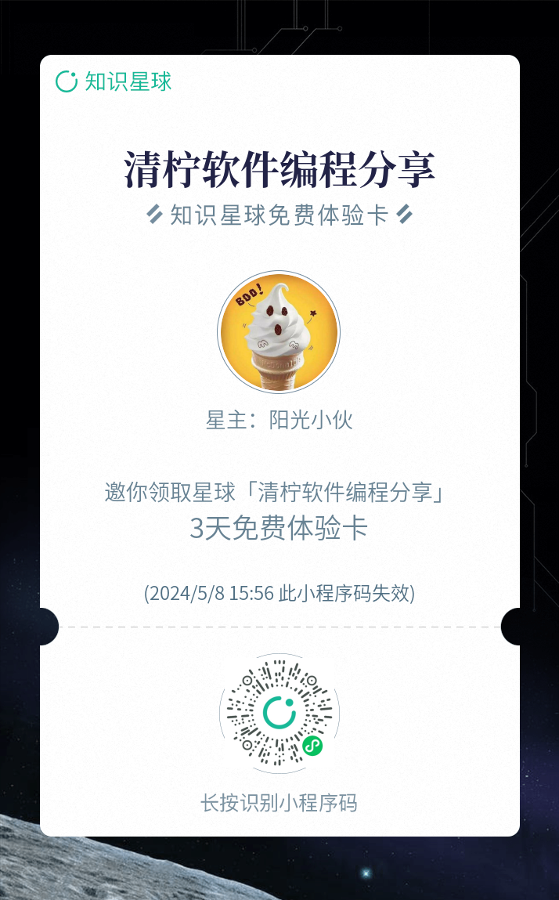

## 宠物医院管理系统
#### 运行图片




#### 设计原型

涉及终端  ， 后台管理系统

#### 搭建框架

1. 涉及多个版本， ssm， springboot微服务版本

2. 前端使用vue，小程序使用原生进行开发

3. 数据库是用 mysql 8.0

4. 后台设计技术栈：

   logback 日志输出，

   Springboot2.5，

   mybatis-plus, 

   swagger

   Jwt

   minio 文件服务器

   spring 拦截器使用


#### 开发需求


1. ##### 技术

   数据库：mysql8.0

   项目框架：

   ​	后端 java： 使用 springboot

   ​     后台管理系统： vue

    	小程序：原生开发--选配功能
    	
    	web 网页： 基于vue

2. ##### 项目搭建

   1. 底层框架 Springboot2.5
   2. 数据库连接 jdbc
   3. 数据库操作 mybatis-plus
   4. 文件上传 拦截器+文件路径映射
   5. 文件服务器搭建
   6. 支付宝沙箱对接
   7. 微信获取头像，用户信息
   8. 微信支付对接
   9. swagger+knife4j 接口文档
   10. AOP 切片
   11. easyexcle 文件导出

3. ##### 算法

   1. 协同过滤--选配功能

#### 软件架构

```
├── LICENSE
├── README.en.md
├── README.md
├── pom.xml
├── src
│   └── main
│       ├── java
│       │   └── com
│       ├── resources
│       │   ├── config.properties
│       │   ├── doc
│       │   ├── log4j.properties
│       │   ├── mapper
│       │   ├── mybatis
│       │   └── spring
│       └── webapp
│           ├── WEB-INF
│           ├── front
│           ├── index.jsp
│           ├── index.jsp.bak
│           ├── jsp
│           ├── muban.jpg
│           ├── muban.jpg.bak
│           ├── muban2.jpg
│           ├── resources
│           └── upload
└── target
    ├── classes
    │   ├── com
    │   │   ├── annotation
    │   │   ├── config
    │   │   ├── controller
    │   │   ├── dao
    │   │   ├── entity
    │   │   ├── interceptor
    │   │   ├── model
    │   │   ├── service
    │   │   └── utils
    │   ├── config.properties
    │   ├── doc
    │   │   └── sys_user.sql
    │   ├── log4j.properties
    │   ├── mapper
    │   │   ├── CommonDao.xml
    │   │   ├── ConfigDao.xml
    │   │   ├── DingdanxinxiDao.xml
    │   │   ├── KeshixinxiDao.xml
    │   │   ├── MessagesDao.xml
    │   │   ├── NewsDao.xml
    │   │   ├── TokenDao.xml
    │   │   ├── UserDao.xml
    │   │   ├── YaopinxinxiDao.xml
    │   │   ├── YishengDao.xml
    │   │   ├── YishengxinxiDao.xml
    │   │   ├── YixuezhishiDao.xml
    │   │   ├── YizhuxinxiDao.xml
    │   │   ├── YonghuDao.xml
    │   │   └── YuyueguahaoDao.xml
    │   ├── mybatis
    │   │   └── mybatis-config.xml
    │   └── spring
    │       ├── spring-mvc.xml
    │       ├── spring-mybatis.xml
    │       └── spring.xml
    └── jspmjl5mx
        ├── META-INF
        │   └── MANIFEST.MF
        ├── WEB-INF
        │   ├── classes
        │   ├── lib
        │   ├── pages
        │   └── web.xml
        ├── front
        │   ├── css
        │   ├── elementui
        │   ├── img
        │   ├── index.jsp
        │   ├── js
        │   ├── layui
        │   ├── modules
        │   ├── muban.jpg
        │   ├── pages
        │   └── xznstatic
        ├── index.jsp
        ├── index.jsp.bak
        ├── jsp
        │   ├── login.jsp
        │   ├── modules
        │   ├── pay.jsp
        │   ├── static
        │   └── utils
        ├── muban.jpg
        ├── muban.jpg.bak
        ├── muban2.jpg
        ├── resources
        │   ├── My97DatePicker
        │   ├── assets2
        │   ├── charts
        │   ├── css
        │   ├── datatable
        │   ├── fonts
        │   ├── images
        │   ├── js
        │   └── ueditor
        └── upload
            ├── 1615479617045.jpg
            ├── keshixinxi_tupian1.jpg
            ├── keshixinxi_tupian2.jpg
            ├── keshixinxi_tupian3.jpg
            ├── keshixinxi_tupian4.jpg
            ├── keshixinxi_tupian5.jpg
            ├── keshixinxi_tupian6.jpg
            ├── news_picture1.jpg
            ├── news_picture2.jpg
            ├── news_picture3.jpg
            ├── news_picture4.jpg
            ├── news_picture5.jpg
            ├── news_picture6.jpg
            ├── picture1.jpg
            ├── picture2.jpg
            ├── picture3.jpg
            ├── test.txt
            ├── yaopinxinxi_tupian1.jpg
            ├── yaopinxinxi_tupian2.jpg
            ├── yaopinxinxi_tupian3.jpg
            ├── yaopinxinxi_tupian4.jpg
            ├── yaopinxinxi_tupian5.jpg
            ├── yaopinxinxi_tupian6.jpg
            ├── yisheng_touxiang1.jpg
            ├── yisheng_touxiang2.jpg
            ├── yisheng_touxiang3.jpg
            ├── yisheng_touxiang4.jpg
            ├── yisheng_touxiang5.jpg
            ├── yisheng_touxiang6.jpg
            ├── yishengxinxi_touxiang1.jpg
            ├── yishengxinxi_touxiang2.jpg
            ├── yishengxinxi_touxiang3.jpg
            ├── yishengxinxi_touxiang4.jpg
            ├── yishengxinxi_touxiang5.jpg
            ├── yishengxinxi_touxiang6.jpg
            ├── yixuezhishi_tupian1.jpg
            ├── yixuezhishi_tupian2.jpg
            ├── yixuezhishi_tupian3.jpg
            ├── yixuezhishi_tupian4.jpg
            ├── yixuezhishi_tupian5.jpg
            ├── yixuezhishi_tupian6.jpg
            ├── yonghu_touxiang1.jpg
            ├── yonghu_touxiang2.jpg
            ├── yonghu_touxiang3.jpg
            ├── yonghu_touxiang4.jpg
            ├── yonghu_touxiang5.jpg
            └── yonghu_touxiang6.jpg
```

#### 安装教程

1.  导入数据库，数据库使用mysql8.0
2.  修改本地配置文件，更改数据库账号密码
3.  修改本地图片存储路径
4.  运行的后台代码，使用 idea 工具，直接启动即可
5.  启动成功之后会自动打开网页 

#### 使用说明

1.  联系我
2.  
3.  
4. 

#### 参与贡献

1.  Fork 本仓库
2.  新建 Feat_xxx 分支
3.  提交代码
4.  新建 Pull Request


#### 特技

1.  使用 Readme\_XXX.md 来支持不同的语言，例如 Readme\_en.md, Readme\_zh.md
2.  Gitee 官方博客 [blog.gitee.com](https://blog.gitee.com)
3.  你可以 [https://gitee.com/explore](https://gitee.com/explore) 这个地址来了解 Gitee 上的优秀开源项目
4.  [GVP](https://gitee.com/gvp) 全称是 Gitee 最有价值开源项目，是综合评定出的优秀开源项目
5.  Gitee 官方提供的使用手册 [https://gitee.com/help](https://gitee.com/help)
6.  Gitee 封面人物是一档用来展示 Gitee 会员风采的栏目 [https://gitee.com/gitee-stars/](https://gitee.com/gitee-stars/)